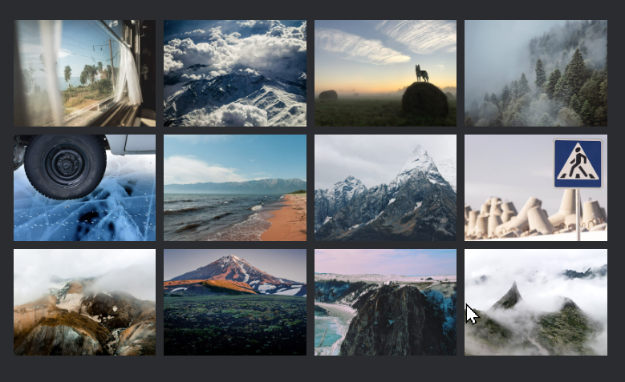

<!DOCTYPE html>
<html lang="en">
<head>
  <meta charset="UTF-8">
  <meta name="viewport" content="width=device-width, initial-scale=1.0">
  
</head>
<body>
  

    
 Разверните для просмотра краткой информации о проектах или перейдите в 📌 Pinned

    

      <ol>
        <li>
          
🚋 Путешествия по России

          <ul style="padding-bottom: 10px">
            <li>Создала адаптивный интерфейс с использованием Flex, Grid и медиазапросов для обеспечения корректного отображения сайта на различных устройствах.</li>
            <li>Применяла методологию БЭМ для улучшения структуры и поддерживаемости кода.</li>
            

              
👉 Скриншоты сайта

              

                
                
                
              

            

          </ul>
        </li>
        <li>
          
📊 Визуализатор работы алгоритмов и структур данных

          <ul style="padding-bottom: 10px">
            <li>Для реализации пошагового визуализатора работы алгоритмов и структур данных изучила и внедрила паттерн проектирования «Снимок» (Memento), что значительно повысило переиспользуемость кода.</li>
            <li>Проект включает тестирование с использованием Cypress, Jest и React Testing Library.</li>
          </ul>
        </li>
        <li>
          
🍔👽 Космическая бургерная

          <ul style="padding-bottom: 10px">
            <li>Разработала интерактивное веб-приложение для создания бургеров, управления профилем и отслеживания заказов в реальном времени с помощью WebSocket и REST API.</li>
            <li>Использовала Redux и Middleware для эффективного управления состоянием.</li>
            <li>Внедрила React Router для удобной навигации и работы с заказами, а также react-intersection-observer и Drag-and-drop для улучшения пользовательского опыта.</li>
          </ul>
        </li>
      </ol>
    

  

</body>
</html>
