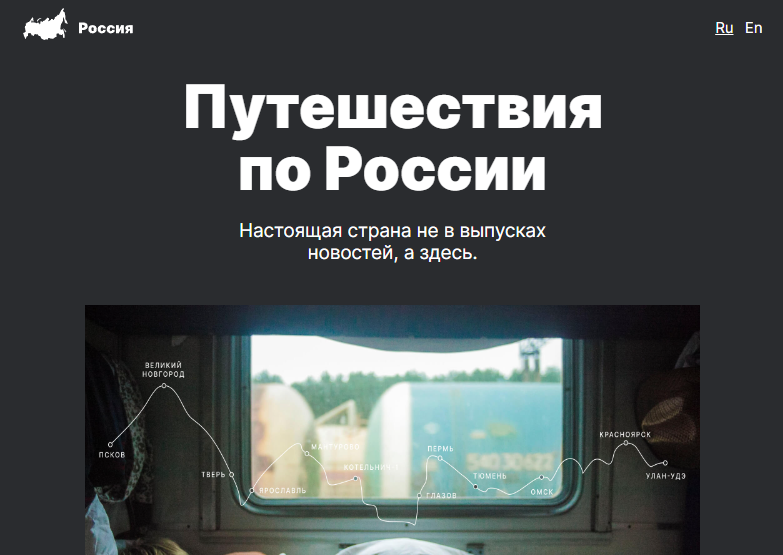
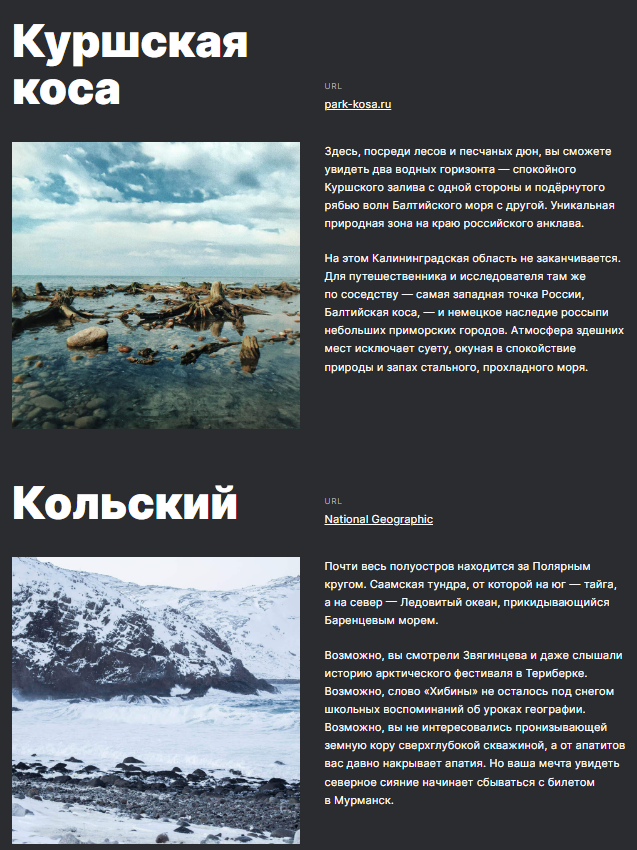
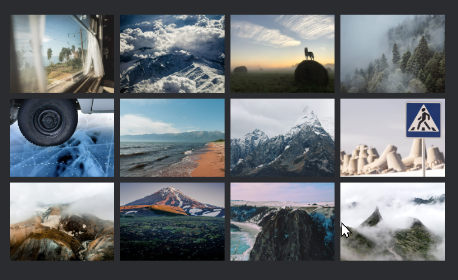
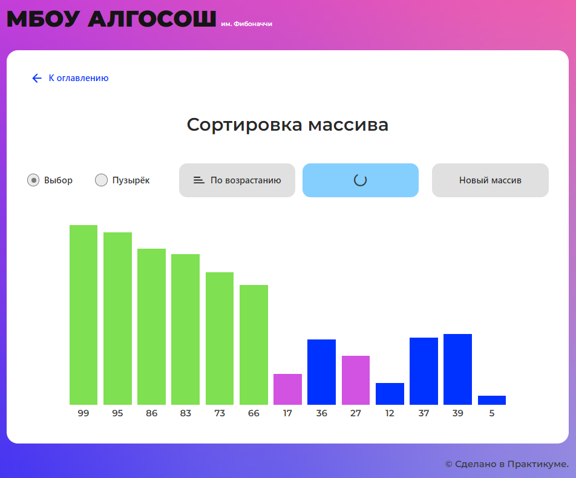
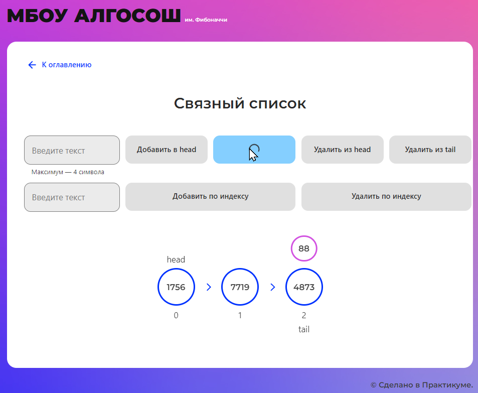
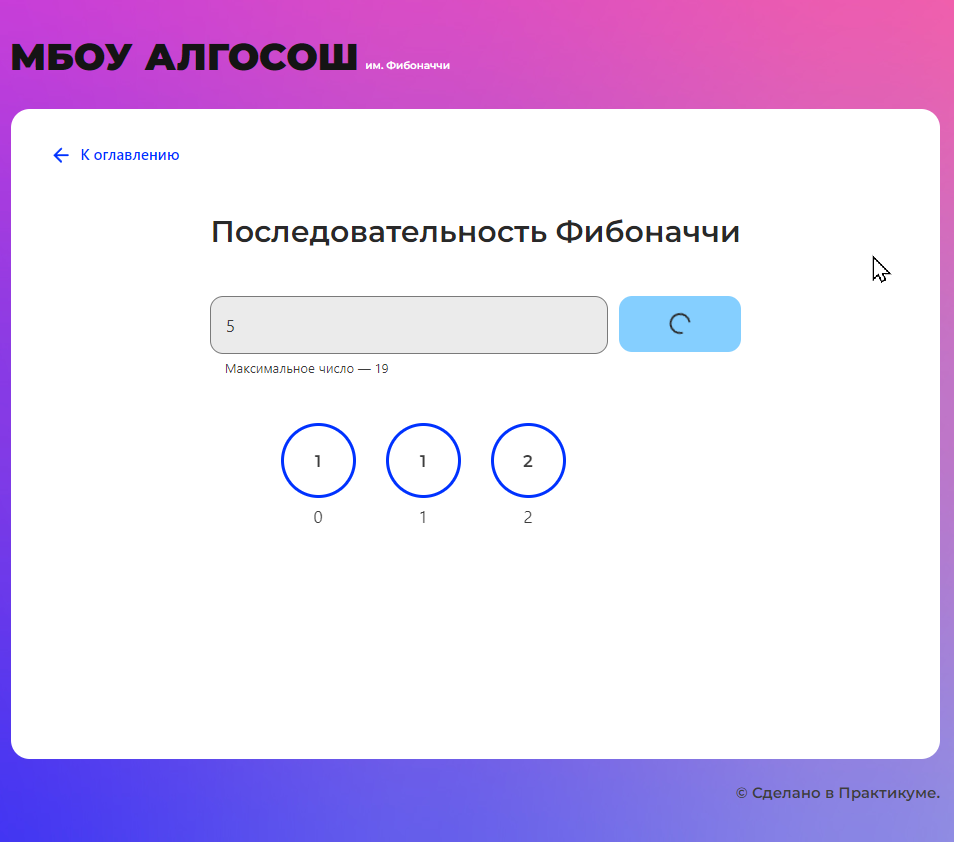
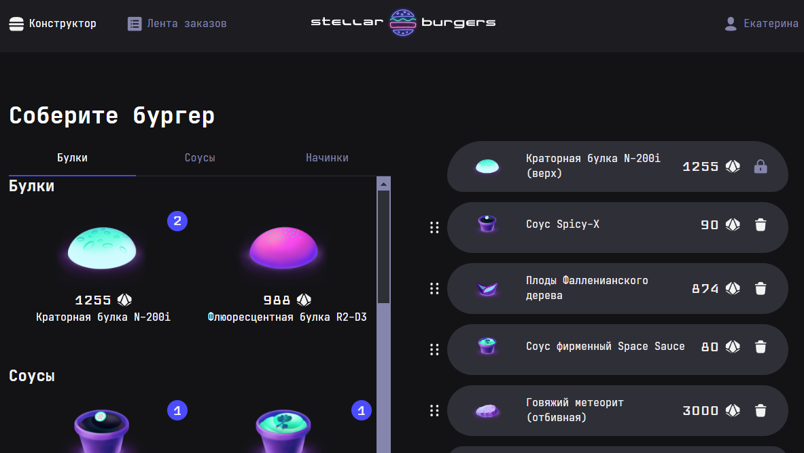
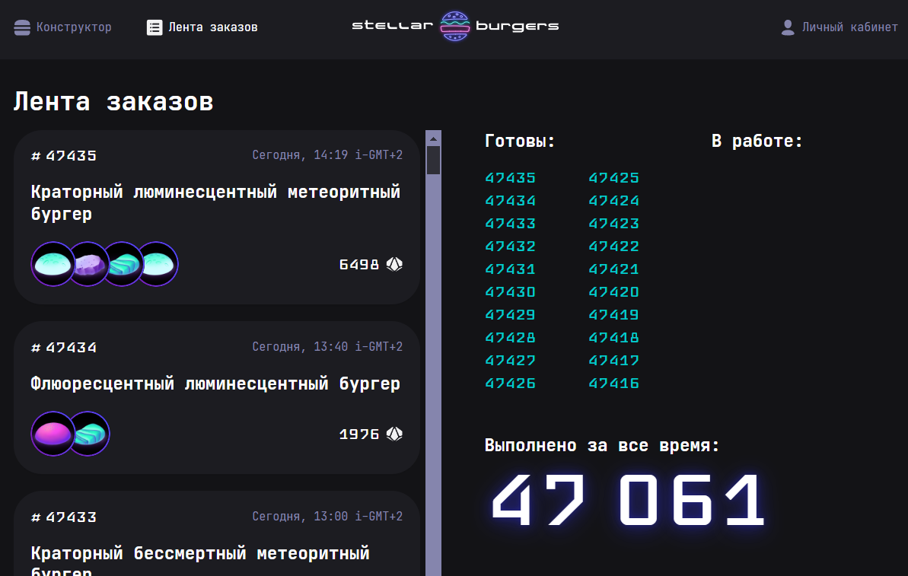
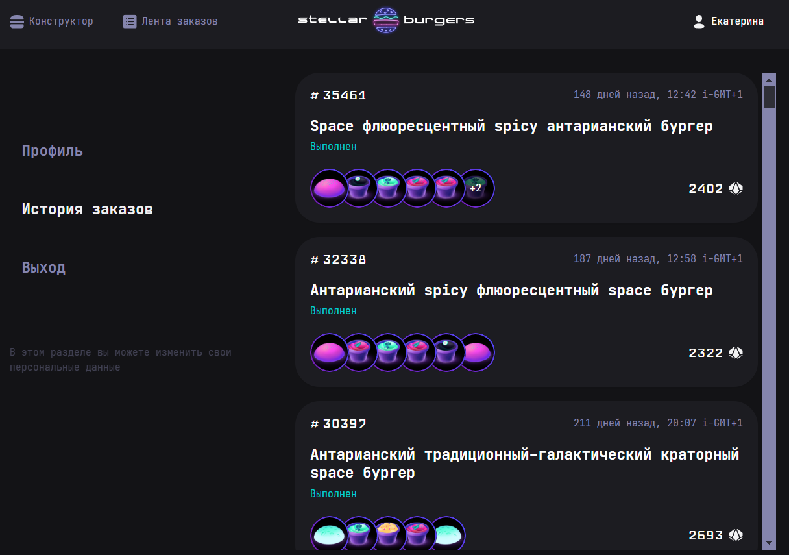

<!---

--->

# 🐼 Привет, меня зовут Екатерина! 🖖

**Я Frontend-разработчик** :octocat:

📆 В ИТ я около 8-ми лет. В начале работала консультантом 1С по технической и методологической поддержке пользователей. Участвовала в самых разных проектах - от внедрения уже готовых продуктов, до автоматизации бизнес процессов под нужды заказчиков. ⛄ Не однократно помогала возобновить и успешно закончить ранее замороженные проекты. 💻 Последние два года работала разработчиком 1С ... тут то всё и закрутилось ... 💫😍

🎓📝 Сейчас я выпускница курса ["Web-разработчик+"](https://practicum.yandex.ru/web-plus/). Во время прохождения курса я написала несколько проектов на HTML, CSS и JavaScript, работала с адаптивной вёрсткой. Так же создала интерактивные приложения с Node.js на React и Redux, не обошла стороной и TypeScript.

  

    Разверните для просмотра краткой информации о проектах или перейдите в 
    <a href="https://github.com/gudrum1983#:~:text=Pinned,Loading">📌 Закрепы</a>
  

  <ol>
    <li>
      

        🚋 Путешествия по России [
        <a href="https://github.com/gudrum1983/russian-travel"> 📂 Репозиторий</a> 
        | <a href="https://gudrum1983.github.io/russian-travel">🌐Сайт</a> ]
      

      <ul style="padding-bottom: 10px">
        <li>Создала адаптивный интерфейс с использованием Flex, Grid и медиазапросов для обеспечения корректного отображения сайта на различных устройствах.</li>
        <li>Применяла методологию БЭМ для улучшения структуры и поддерживаемости кода.</li>
        

          
🖼️ Скриншоты сайта

          

            
            
            
          

        

      </ul>
    </li>
    <li>
      

        📊 Визуализатор работы алгоритмов и структур данных [
        <a href="https://github.com/gudrum1983/algososh"> 📂 Репозиторий</a> 
        | <a href="https://gudrum1983.github.io/algososh">🌐Сайт</a> ]
      

      <ul style="padding-bottom: 10px">
        <li>Для реализации пошагового визуализатора работы алгоритмов и структур данных изучила и внедрила паттерн проектирования «Снимок» (Memento), что значительно повысило переиспользуемость кода.</li>
        <li>Проект включает тестирование с использованием Cypress, Jest и React Testing Library.</li>
        

          
🖼️ Скриншоты сайта

          

            
            
            
          

        

      </ul>
    </li>
    <li>
      

        👽 Космическая бургерная 🍔 [
        <a href="https://github.com/gudrum1983/react-stellar-burger"> 📂 Репозиторий</a> 
        | <a href="https://gudrum1983.github.io/react-stellar-burger">🌐Сайт</a> ]
      

      <ul style="padding-bottom: 10px">
        <li>Разработала интерактивное веб-приложение для создания бургеров, управления профилем и отслеживания заказов в реальном времени с помощью WebSocket и REST API.</li>
        <li>Использовала Redux и Middleware для эффективного управления состоянием.</li>
        <li>Внедрила React Router для удобной навигации и работы с заказами, а также react-intersection-observer и Drag-and-drop для улучшения пользовательского опыта.</li>
        

          
🖼️ Скриншоты сайта

          

            
            
            
          

        
      
			</ul>
    </li>
  </ol>
  Так же все вышеперечисленные проекты собраны <a href="https://github.com/stars/gudrum1983/lists/portfolio">👉 в портфолио</a>.

🚴 В свободное от учебы время катаюсь на велосипеде и 🧶 вяжу крючком - получается пока хуже, чем проекты на TS, но я уверена что и тут у меня всё получится! 🌟🌟🌟

🔮 Skills
---

#### 📧 KochkinaEA@yandex.ru | [Telegram](https://t.me/Katherine_Kochkina) | [📄 Резюме на HH.ru](https://hh.ru/resume/770743f9ff0d78256b0039ed1f50774143656c)

<!---
gudrum1983/gudrum1983 is a ✨ special ✨ repository because its `README.md` (this file) appears on your GitHub profile.
You can click the Preview link to take a look at your changes.
--->
